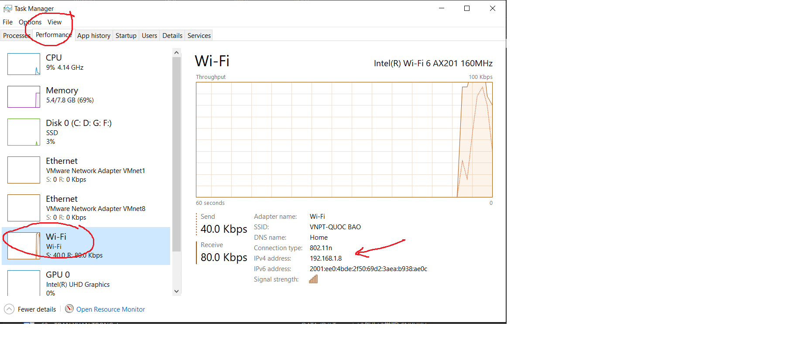

# Plant disease detection là 1 app di động được xây dựng và phát triển bởi nhóm đồ án PBL4 Hệ thống thông minh.
Từ nhu cầu thực tế và tính cần thiết phải phát triển một phần mềm giúp đỡ người nông dân phát hiện bệnh trên lá cây. Chúng em đã quyết định xây dựng một app mobile kết nối với model AI, flask server và mongoDB.. để tạo nên một công cụ giúp ích thiết thực cho người dùng trực tiếp phát hiện bệnh trên lá cây bằng camera điện thoại hoặc ảnh có sẵn trên thư viện điện thoại.
Một số tính năng cơ bản của app: Có thể dự đoán với độ chính xác cao bệnh trên lá cây và đưa ra một vài ví dụ cũng như là đưa ra những phương án hiệu quả để chữa bệnh trên cây
Do thời gian thực hiện còn ít nên dự án vẫn còn nhiều thiếu sót. Trong tương lai, chúng mình sẽ tiếp tục hoàn thiện và mở rộng dự án, xây dựng server lớn hơn phục vụ nhiều người dùng hơn; training model nhận diện được đa dạng loại cây hơn với độ chính xác cao hơn...
# PLANT-DISEASES-DETECTION

## To use this project, do the following:
### Download my_model.h5 from https://drive.google.com/file/d/1AUo0TGSxJxEe6Bsy_gUXHTHmeHcPKLbJ/view?usp=sharing then move model.h5 to FlaskServer folder
### Open the Android Studio project and run it to create the APK and run the app.
### After the server is up and running, then go back to the Android app, in Api/Services => edit the IPv4 address to reflect the current IPv4 address of the server. 

### If the port number used in the project which is 5000 is used by another app in your machine, you need to change the port number in both the client and server.
